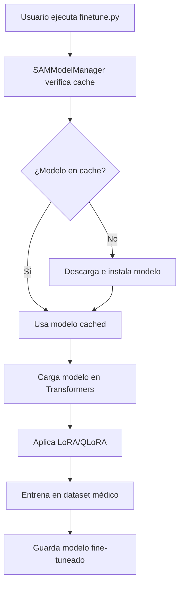

# Integración SAMModelManager con Fine-tuning

## 🔗 Cómo funciona la integración

El `SAMModelManager` ahora está **completamente integrado** en el proceso de fine-tuning. Aquí se explica cómo:

### 📋 Arquitectura de la Integración

```
┌─────────────────────┐    ┌─────────────────────┐    ┌─────────────────────┐
│   SAMModelManager   │───▶│     finetune.py     │───▶│   Modelo Entrenado  │
│                     │    │                     │    │                     │
│ • Descarga modelos  │    │ • Carga modelo HF   │    │ • Guardado local    │
│ • Instala deps      │    │ • Aplica LoRA/QLoRA │    │ • Listo para uso    │
│ • Gestiona cache    │    │ • Entrena en datos  │    │                     │
└─────────────────────┘    └─────────────────────┘    └─────────────────────┘
```

### 🔧 Configuración de Modelos

En `finetune.py`, cada modelo tiene una configuración dual:

```python
MODEL_CONFIG = {
    "mobilesam": {
        "hf_id": "dhkim2810/MobileSAM",          # Para transformers
        "manager_family": "mobilesam",            # Para SAMModelManager
        "manager_variant": "vit_t",               # Variante específica
        "description": "Mobile SAM - Lightweight version"
    },
    # ... más modelos
}
```

### 🚀 Proceso de Fine-tuning Integrado

#### 1. **Preparación automática del modelo**
```bash
python finetune.py --model mobilesam --dataset cataract --dataset-root data/Cataract\ COCO\ Segmentation/train
```

**Lo que sucede internamente:**
1. ✅ `SAMModelManager` instala dependencias del modelo (si es necesario)
2. ✅ Descarga el checkpoint nativo del modelo 
3. ✅ Guarda el modelo en cache local
4. ✅ `finetune.py` carga el modelo de Hugging Face para compatibilidad
5. ✅ Aplica LoRA/QLoRA según especificado
6. ✅ Entrena en el dataset médico

#### 2. **Funciones clave de integración**

**`setup_model_with_manager()`**: 
- Coordina entre SAMModelManager y Hugging Face
- Maneja fallbacks automáticos
- Proporciona logging detallado

**`create_model()`**:
- Usa la configuración dual
- Aplica métodos de fine-tuning
- Retorna modelo listo para entrenamiento

### 📊 Ventajas de la Integración

1. **🔄 Automatización Total**: Un solo comando maneja todo el proceso
2. **💾 Cache Inteligente**: Los modelos se descargan una sola vez
3. **🛡️ Fallback Robusto**: Si falla SAMModelManager, usa Hugging Face directo
4. **📱 Flexibilidad**: Soporta múltiples variantes de SAM
5. **🔧 Mantenible**: Configuración centralizada y modular

### 🧪 Comandos de Demostración

```bash
# Listar modelos disponibles
python finetune.py --list-models

# Ver estado del gestor de modelos
python finetune.py --show-manager-status

# Fine-tuning completo (con setup automático)
python finetune.py --model mobilesam --method lora --dataset cataract --dataset-root data/Cataract\ COCO\ Segmentation/train --epochs 5

# Demo sin dependencias pesadas
python demo_integration.py --simulate-finetune mobilesam
```

### 📂 Estructura de Archivos Resultante

```
finetuning-models-segmentation/
├── models/                          # Cache de SAMModelManager
│   ├── mobile_sam.pt               # Checkpoint nativo
│   └── sam_vit_b_01ec64.pth        # Otros modelos
├── finetuned-mobilesam-lora-cataract/  # Modelo fine-tuneado
│   ├── adapter_config.json
│   ├── adapter_model.bin
│   └── preprocessor_config.json
└── finetune.py                      # Script principal integrado
```

### 🎯 Casos de Uso

1. **Investigación Médica**: Entrenar SAM en datasets específicos
2. **Producción**: Modelos optimizados para aplicaciones médicas  
3. **Comparación**: Evaluar diferentes variantes de SAM
4. **Despliegue**: Modelos listos para inferencia

### 🔄 Flujo Completo de Trabajo



## ✅ Resultado

Ahora el **SAMModelManager está completamente integrado** en el pipeline de fine-tuning:
- ✅ Setup automático de modelos
- ✅ Cache inteligente
- ✅ Fallbacks robustos  
- ✅ Proceso unificado
- ✅ Configuración centralizada

El usuario solo necesita ejecutar **un comando** y todo el proceso se maneja automáticamente.
